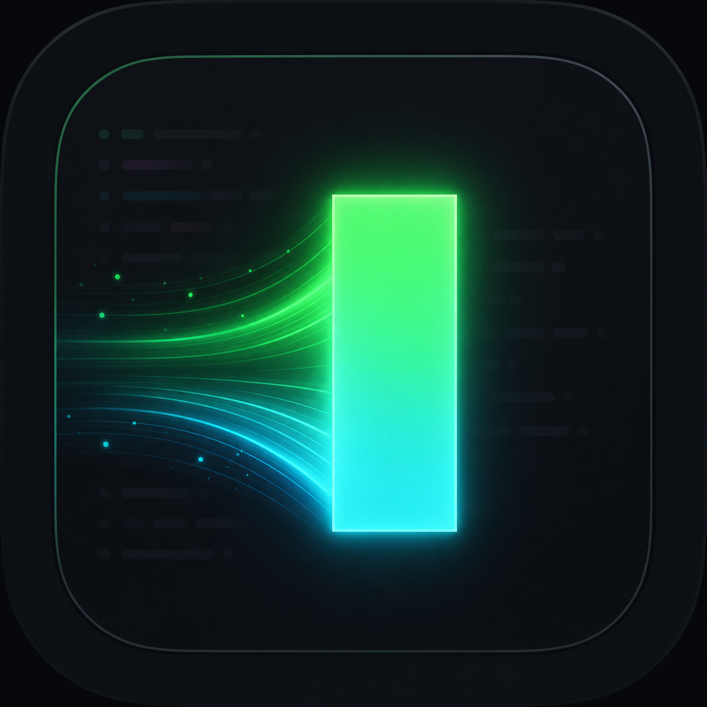

# Neobeam

<p align="center">
  
</p>

A GPU-accelerated Neovim GUI written in Rust. It embeds Neovim, renders the editor with wgpu, and layers smooth motion on top — inspired by [4coder](https://4coder.net/)'s feel and borrowing animation ideas from [Neovide](https://neovide.dev/).

```
┌─────────────────────────────────────────────┐
│  winit window  ·  wgpu renderer  ·  ImGui   │
├─────────────────────────────────────────────┤
│  editor-surface  (glyphs, animations, VFX)  │
├─────────────────────────────────────────────┤
│  nvim-core  (RPC session, grid state, input)│
├─────────────────────────────────────────────┤
│  Neovim (--embed)                           │
└─────────────────────────────────────────────┘
```

## Features

- **Embedded Neovim** — spawns `nvim --embed` and speaks the UI protocol over RPC
- **GPU text rendering** — glyph atlas, syntax highlighting, multi-grid floats and splits
- **Smooth animations** — interpolated cursor, scroll springs, highlight flashes, float fade/slide
- **Cursor effects** — glow, trails, squash/stretch, and optional power-mode particles
- **Neovide-compatible VFX** — `sonicboom`, `railgun`, `torpedo`, `pixiedust` cursor modes
- **Live settings** — in-app panel with hot-reload from disk

## Requirements

- [Rust](https://rustup.rs/) (2021 edition)
- [Neovim](https://neovim.io/) on your `PATH` (used via `--embed`)
- A monospace font; Nerd Font glyphs are supported for icons

macOS is the primary target today, but the editor runs on other platforms too.

## Build & run

```bash
cargo build --release
./target/release/neobeam
```

On first launch, a default config is written to:

```
~/.config/neobeam/settings.json
```

Edit that file while the app is running — changes reload automatically when the settings panel is closed.

## Settings

Open the in-app settings panel with **⌘,** (Cmd+Comma). Press **Esc** to cancel, or **Apply** to save.

| Setting | Description |
|---|---|
| `font_family` | Monospace family name, or `null` for system default |
| `font_size` | Cell height in pixels |
| `line_height` | Line spacing multiplier |
| `animations_enabled` | Master toggle for all motion |
| `power_mode` | Screen shake and typing particles |
| `cursor_glow` | Bloom around the cursor (0 = off) |
| `scroll_animation_length` | Smooth-scroll duration in seconds |
| `vfx_modes` | Comma-separated cursor VFX, e.g. `railgun,sonicboom` |

If your Neovim config sets `g:neovide_scroll_animation_length` or `g:neovide_scroll_animation_far_lines`, those values are picked up on startup when the corresponding keys are absent from `settings.json`.

## Project layout

| Crate | Role |
|---|---|
| [`crates/neobeam`](crates/neobeam) | Binary (`neobeam`): window loop, input, settings UI |
| [`crates/nvim-core`](crates/nvim-core) | Neovim session, protocol parsing, grid/window state |
| [`crates/editor-surface`](crates/editor-surface) | wgpu renderer, fonts, animation engine, cursor VFX |

`nvim-core` is deliberately windowing- and GPU-agnostic so protocol and grid logic can be tested without a display.

## Development

```bash
# Run tests (spawns real nvim processes for integration tests)
cargo test

# Verbose logging (`cargo run` stays attached to the terminal)
RUST_LOG=neobeam=debug cargo run -p neobeam

# Release binary detaches from the shell by default; keep the terminal for logs:
RUST_LOG=neobeam=debug ./target/release/neobeam --foreground
```

## Credits

- **[4coder](https://4coder.net/)** and Ryan Fleury — the original inspiration for smooth, frame-delta editor animations (cursor interpolation, trails, glow, power mode).
- **[Neovide](https://neovide.dev/)** — spring-based scroll and cursor motion, blink timing, cursor particle VFX (`railgun`, `torpedo`, `pixiedust`, `sonicboom`), and scroll global compatibility. Several subsystems in `editor-surface` are direct ports of Neovide's approach.
- **[Dear ImGui](https://github.com/ocornut/imgui)** — settings panel overlay.
- **[wgpu](https://wgpu.rs/)** — cross-platform GPU rendering.

## License

MIT
